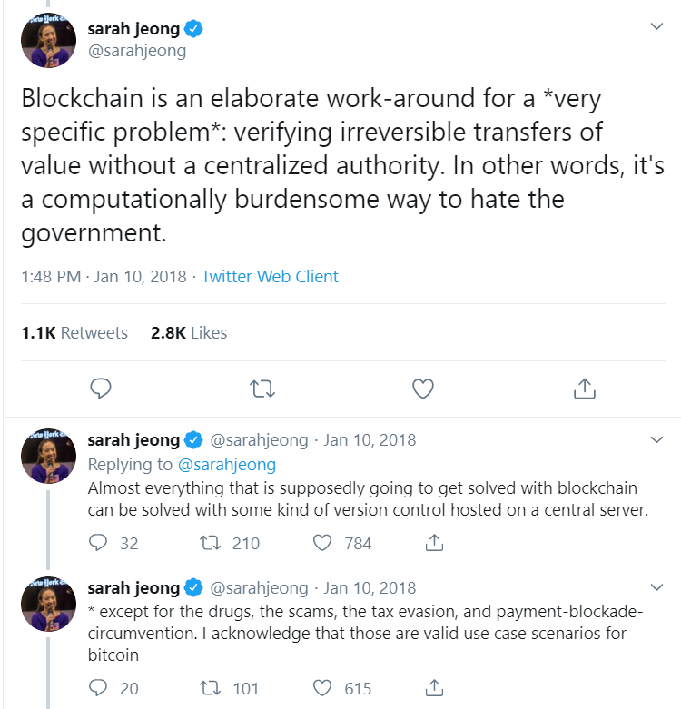

# what-to-tell-your-boss-when-your-boss-wants-blockchain

##### A repo of tech buzzwords, what they mean, how they're used in international development, and what to tell your boss when they tell you they want to use new tech

This repo is the result of a fantastic conversation during MERL Tech 2019 where an international development practitioner asked if there were resources or stock phrases they could use to push back on their managers when their managers ask for emerging tech solutions. Specifically, do you need to spend donor funding on blockchain, or do you just need a database with version control?

Before implementing any new technology, there are several key questions to ask:
- What is the problem we're trying to solve?
- Have we struggled with implementing technologies before?
- Is the problem a symptom of something else?
- Will a spreadsheet resolve this?

Here are a few technology solutions, definitions of what they are, and a couple of examples of why you DON'T want to use them.

#### Blockchain
_What is blockchain_
- Blockchain is a digital public ledger of permanent, tamper-proof records of data.
- Blockchain is a decentralized database.
- Blockchain records transactions, encrypts and authenticates them, and makes them visible to all users.
- Every blockchain user has the same copy of the blockchain as everyone else.

_But do I need blockchain?_
Probably not! The majority of the issues that you think you need blockchain for can be solved by a centralised database with version control. Or to put it in a tongue-in-cheek way:

_OK, so what do I say to my boss?_
- Ask your boss if a spreadsheet will solve the problem at hand!
- Mention how computationally expensive blockchain is [(as well as all the other limitations others have talked about!)](https://www.coindesk.com/information/blockchains-issues-limitations)
- Refer to some of the fantastic resources that answer this question, like [this one](https://medium.com/@elseidy/to-blockchain-or-to-not-blockchain-40e6a3a60f46). It even has a flowchart!
